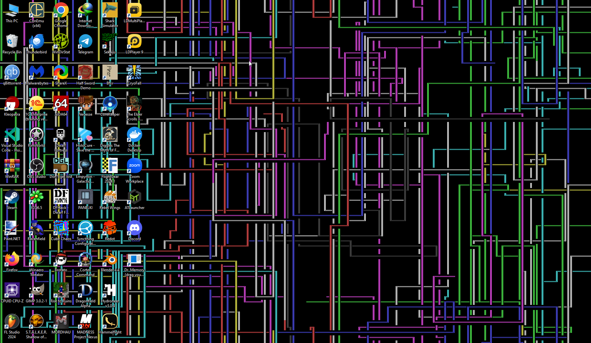

# dwarfpaper

A Live wallpaper app that renders classic Dwarf Fortress styled ASCII vomit all over your desktop. Only works on Windows due to the amount of winapi hacks involved. Below is a screenshot of the program in action:




## Usage

Run the provided binary, making sure it can read [`9x16.png`](assets/9x16.png) from the working directory. Use the following command-line options to customize the program's behavior:

- `-m`/`--mode`: Select one of the supported modes by name. Only `pipes` is available as of now.
- `-D`/`--debug`: Run the simulation in a separate window rather than as your actual wallpaper. Perfect for one-off tests.

TODO: publish a binary.

TODO: add multi-monitor support.

## Building

In short, run:

```sh
cmake -S . -B build -G Ninja
cmake --build build
cd build
./dwarfpaper.exe
```
